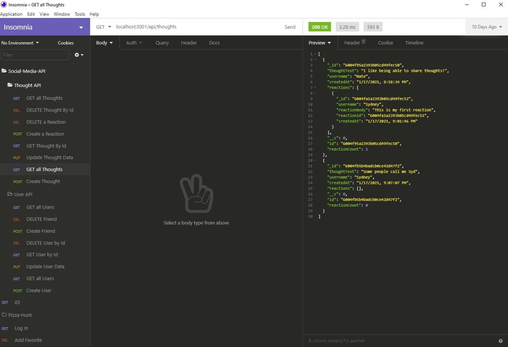

# Social-Network-API

## Application Description

Created a backend API for use in a social media application

## Technology Used

* Node.js
* MongoDB
* Mongoose
* express

## Installation

* npm i
* npm start (from the root directory)

## How to Use

This is specifically a backend application which could be tied to a front end application. As it stands users will need to interact with this through applications such as Insomnia Core.

## Questions

Feel free to contact me with any questions.